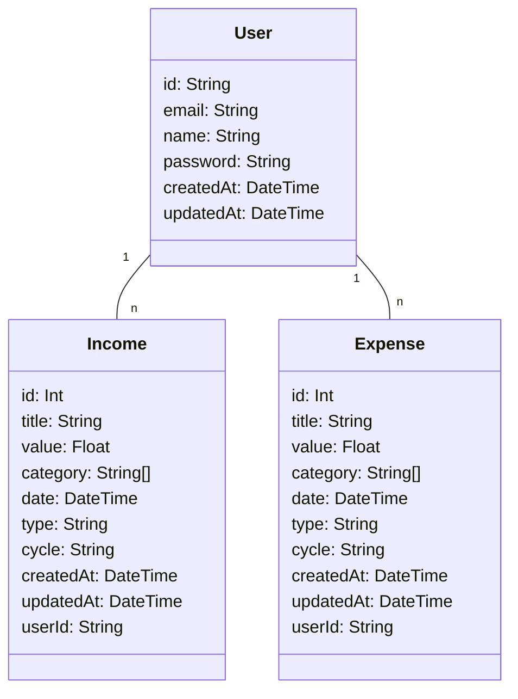

# API for Budget Duck

## Overview

Budget Duck is an application for managing personal finances. 
It enables users to record and manage income and expenses to ensure better budget management.


## Extern Documentation (work in progress)
[Budget Duck Documentation and Blog Repository](https://github.com/moon-penguin/documentation)


## Setup

### Prerequisites

- Node.js (v.22.15.0)
- Docker and Docker Compose
- npm (Node Package Manager)

### Installation

1. Clone the repository
2. Install dependencies

```shell
npm i
```

3. Configure environment variables in the **.example.env** file and rename it to **.env**

4. Start database

```shell
docker compose up
```

This starts the PostgreSQL and Redis database.

5. Start API

```shell
npm run start
```

Will start the API, which will be ready for incoming 
requests.

6. Start database ui (optional)

```shell
npm run db:ui
```

This starts the Prisma Studio database ui.

You can access prisma studio at http://localhost:5555

## Documentation OpenAPISpecification

After starting the API, you can access the documentation
at http://localhost:3000/api/documentation

### API Endpoints
The Budget Duck API likely provides the following endpoints:
#### Authentication
- `POST /api/auth/register` - Register a new user
- `POST /api/auth/login` - Log in and receive a JWT token

#### Income
- `GET /api/incomes` - Retrieve all income of the logged-in user
- `GET /api/incomes/:id` - Retrieve a specific income
- `POST /api/incomes` - Create new income
- `PUT /api/incomes/:id` - Update income
- `DELETE /api/incomes/:id` - Delete income

#### Expenses
- `GET /api/expenses` - Retrieve all expenses of the logged-in user
- `GET /api/expenses/:id` - Retrieve a specific expense
- `POST /api/expenses` - Create new expense
- `PUT /api/expenses/:id` - Update expense
- `DELETE /api/expenses/:id` - Delete expense

### Authentication
The API uses JSON Web Tokens (JWT) for authentication:
- All API routes are protected and require a valid JWT
- To obtain a JWT, you must either register a user or log in with an existing user
- The token must be sent with each request in the Authorization header

## Data Models and Relationships


